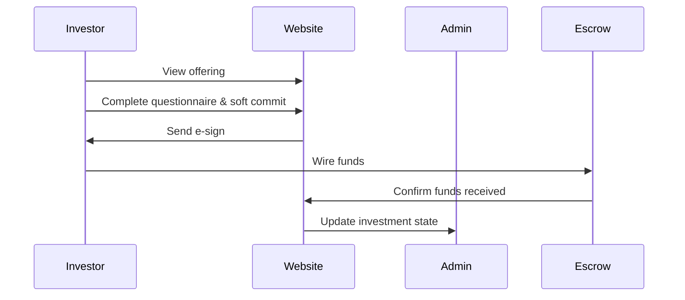
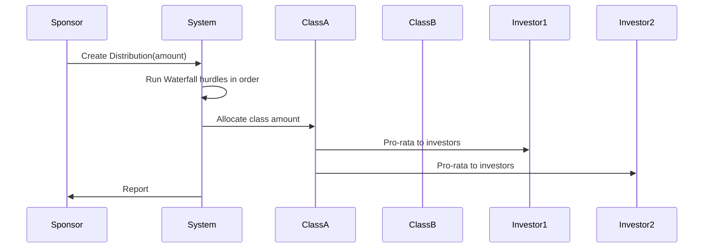

# CashFlow — Professional README

Clear, project-specific documentation and workflows for Deals, Offerings, Deal Classes, Investments, Waterfalls, Distributions and the Partner program used in this repository.

Contact: mateenzahid1598@gmail.com

## Contents

- **Overview**
- **Key Terms**
- **Models & Relationships (quick)**
- **Admin / Sponsor Workflow**
- **Deal Classes: Setup & Rules**
- **Offerings: Lifecycle & Visibility**
- **Investor Flow: From Signup to Funded Investment**
- **Waterfall & Distribution Workflow**
- **Documents & E-sign**
- **Third-party Integrations & Links**
- **Partner Program**
- **Developer Notes & Commands**

---

## Overview

CashFlow models private capital / real-estate style deals. A `Deal` groups one or more `Offering` records. Each `Offering` can publish one or more `DealClass` tranches (equity, preferred, debt) with their economics. Investors create `Investment` records against offerings/classes; distributions are processed via a `WaterFall` configuration that defines ordered hurdles and splits.

This README documents how the system works, how to prepare and publish offerings, how investors interact with the platform, and how distributions are calculated and allocated.

## Key Terms

- **Deal** — main project entity (assets, classes, offerings, documents).
- **Offering** — a capital raise tied to a Deal (public or private link-only).
- **Deal Class** — tranche within a Deal describing minimums, preferred returns, and distribution shares.
- **Investor** — user or entity that can commit capital.
- **Investment** — record of a commitment or funded position tied to Deal/Offering/Class.
- **Waterfall** — ordered allocation rules (hurdles) used during distributions.
- **Distribution** — a cash event applied to a Deal and allocated per waterfall rules.

## Models & Relationships (quick reference)

- `Deal` — hasMany: `DealClass`, `Offering`, `Investment`, `WaterFall`, `Distribution`, `Document`.
- `DealClass` — belongsTo: `Deal`; hasMany: `Investment`, `ClassHurdle`.
- `Offering` — belongsTo: `Deal`; belongsToMany: `DealClass`; hasMany: `Investment`, `Document`, `ESignTemplate`.
- `Investment` — belongsTo: `Deal`, `Offering`, `DealClass`, `Investor`.
- `WaterFall` — belongsTo: `Deal`; hasMany: `WaterFallHurdle`.

See `app/Models/` for model implementations and casts (`MoneyCast`, `PercentageCast`).

## Admin / Sponsor Workflow (create → configure → publish)

1. Create `Deal` and configure deal-level settings (bank accounts, sender addresses, ACH settings, owning entity).
2. Add `DealClass` entries for each tranche. For each class set: type, name, `minimum_investment`, `raise_quota`, `distribution_share`, `preferred_return` (if any).
3. Add `ClassHurdle` entries if class-specific hurdle rules are required (catch-ups, upside limits, honor-only flags).
4. Create `Offering` records tied to the Deal. Configure `offering_size`, `visibility`, `status`, link classes to the offering.
5. Upload offering documents, configure `ESignTemplate` and recipients, and add `OfferingFundingInfo` (wire instructions).
6. Publish or share: use `visibility` flags (dashboard, investor dashboard, or link-only) and move `status` through lifecycle (Draft → Soft Commit → Hard Commit → Open → Closed).

## Deal Classes: Setup & Rules

- `distribution_share` determines how residual distributions are split across classes after hurdle steps.
- `preferred_return` (if present) accrues or is paid based on waterfall configuration.
- Use `ClassHurdle` to set per-class catch-up rules and upside splits.

Example: Class A (LP) 90% share, 6% preferred return; Class B (GP) 10% share with carried interest after LP hurdles.

## Offerings: Lifecycle & Visibility

- Statuses: Draft (1), Open to Soft Commits (2), Open to Hard Commits (3), Open to Investments (4), WaitList (5), Closed (6), Past (7).
- Visibility flags: `show_on_dashboard`, `show_on_deal_investor_dashboard`, `only_visible_on_link`.

Offerings attach `DealClass` rows to control which classes are available to investors for that offering.

## Investor Flow: From Signup to Funded Investment

1. Investor signs up or is onboarded via partner or admin import.
2. Investor views offering (public or partner link) and completes any required questionnaire.
3. Soft Commit: investor records intent (no funds moved).
4. Hard Commit: commitment is formalized (paperwork / signatures may be required).
5. Document signing: subscription documents are sent via e-sign and signed.
6. Funding: sponsor provides wire instructions; investor wires funds.
7. Funds received: investor `investment_status` transitions to `fund_received` and investment becomes active.

### How investor ownership and distributions work

- On funding, investor percentages are stored on the `Investment` (`pcb_ownership`, `op_ownership`).
- At distribution time: class-level allocation = class's share of the pool (after waterfall). Investor-level allocation = class allocation * investor's pro-rata (`pcb_distribution`).

## Waterfall & Distribution Workflow

High-level algorithm:

1. Create a `Distribution` record with `amount` and select the `WaterFall` configuration.
2. For each ordered `WaterFallHurdle`:
   - Calculate amount required for the hurdle (return of capital, accrued preferred return, catch-up, promote).
   - Pay the hurdle from the distribution pool.
   - Apply `upside_split` / `upside_limit` rules if applicable.
3. After hurdles, split remaining funds per final-split rules and by each class's `distribution_share`.
4. Within each class, pro-rate to investors by `investment.pcb_distribution` or `investment.op_distribution`.

Notes:

- Use `Distribution.day_count` and `Distribution.compounding_period` for accurate accruals.
- Edge conditions (partial payments, reserves) must be modeled via waterfall and distribution metadata.

## Documents & E-sign

- Upload documents to `Document` and link them to `Deal` or `Offering`.
- Create `ESignTemplate` and `ESignTemplateRecipient` rows.
- The platform triggers e-sign flows when an investment reaches `document_started`; signed documents advance the investment to funding instructions.

## Third-party Integrations & Links

Integrations are implemented in `app/Lib` and vendor packages. Common integrations include:

- Payment/escrow providers (external reconciliation of wired funds).
- E-sign providers (webhooks update signing status).
- Email/analytics providers.

Check `app/Lib` and `vendor/` to see concrete provider implementations.

## Partner Program

- Partners are admins with `partner` role; they use `/partner` portal.
- Deals are assigned via `partner_deals` pivot with `is_active`, `activation_key`, `role`, and `invitation_email`.
- Partners can invite investors, share link-only offerings, and view performance for assigned deals.

## Developer Notes & Commands

- Model files: `app/Models/Deal.php`, `app/Models/DealClass.php`, `app/Models/Offering.php`, `app/Models/Investment.php`, `app/Models/WaterFall.php`, `app/Models/Distribution.php`.
- Routes: `routes/web.php`, `routes/partner_management.php`, `routes/admin_partner.php`.

Useful commands:

```bash
php artisan optimize:clear
php artisan migrate --path=database/migrations
```

Search tips:

```bash
grep -R "Offering::getStatusTextAttribute" -n
grep -R "investment_status" -n
grep -R "waterfall_hurdle" -n
```

## Troubleshooting (short)

- Offering not visible: check `visibility` and `status`.
- Allocation mismatch: verify day-count, compounding, selected WaterFall and ClassHurdle rules.
- Partner can't see deal: confirm `partner_deals` pivot flags and partner role/middleware.

## Diagrams & Examples

Investment lifecycle (Mermaid):



Distribution allocation (Mermaid):



## Contact

For integration, questions, or partnership: mateenzahid1598@gmail.com

---

If you'd like I can now:

- generate PNGs of the Mermaid diagrams and save them to `docs/`,
- split the admin checklist into `ADMIN_CHECKLIST.md` and create a printable PDF,
- run a spell-check or further condense copy for investor-facing pages.

Tell me which you'd like next.


