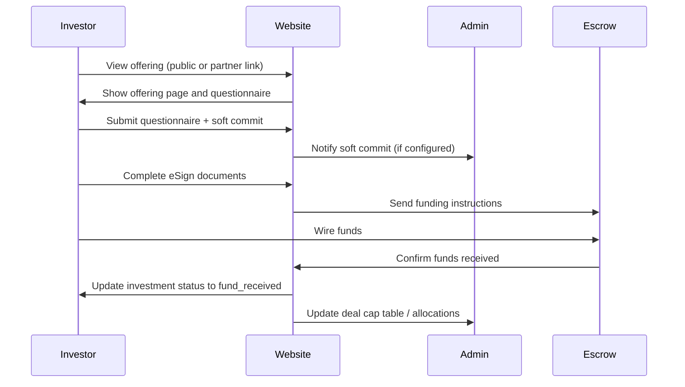
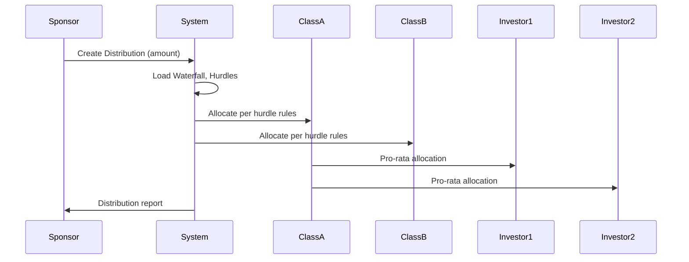

<center>
	<h1>CashFlow — Deals & Offerings Workflow</h1>
</center>

This README documents the project-specific workflow for Deals, Deal Classes, Offerings, Investments, Waterfalls, Distributions and the Partner program as implemented in this repository. It is written to reflect the actual code in this project (models, relationships, routes and typical UI flows). Use this as the single-source quick reference for contributors, partners and integrators.

Contact: mateenzahid1598@gmail.com

---

Table of contents

1. Overview
2. Terminology
3. Core models and relationships
4. Admin / Sponsor workflow (create → configure → publish)
5. Investor onboarding and investment lifecycle
6. Offerings: visibility and status mapping
7. Waterfalls, Hurdles and Distribution calculations (deep dive)
8. Example distribution calculation (step-by-step)
9. E-sign and document flows
10. Partner program and partner flows
11. Partner assignment and permissions
12. Public site and partner portal routes
13. Sequence diagrams (Mermaid)
14. Printable admin checklist
15. Developer notes and pointers
16. API endpoints & useful CLI commands
17. Troubleshooting & FAQs
18. Change log

---

1) Overview

This application models real-estate / private-capital style deals. A `Deal` is the primary container for one or more `Offering`(s). Each offering may expose one or more `DealClass`(es) (equity or debt classes) which define investor eligibility, minimums and distribution shares. Investors place `Investment` records against offerings and classes. Periodic cash flows (distributions) are processed against a `WaterFall` configuration which is composed of ordered hurdles and rules.

This repository implements the following high-level features:
- Creation and management of `Deal` entities.
- Multiple `DealClass` definitions per `Deal` (preferred return, distribution share, minimum investment, price per unit).
- `Offering` lifecycle states (draft → soft commit → hard commit → open → closed) with visibility rules.
- Investor onboarding, questionnaires, and investment lifecycle tracking through signing and funding.
- Waterfall configuration with hurdle logic to compute priority, catch-up and GP provisions.
- Distribution events that apply waterfall logic and create allocation records.
- Partner program and partner-specific dashboards and deal assignment.

2) Terminology

- Deal: Primary project entity containing assets, classes, offerings and documents.
- Offering: A marketed capital raise tied to a `Deal` (may be public or private link-only).
- DealClass: A tranche or class within a deal (e.g., Class A Equity, Preferred Note) specifying economics and allocation rules.
- Investor: Person or entity that can make investments.
- Investment: A record that represents a capital commitment and eventual funded position by an investor in a `Deal`/`Offering`/`DealClass`.
- WaterFall: A named allocation structure for distributions (ordered hurdles that define payment priority and splits).
- Hurdle: A step within a waterfall (preferred return, catch-up, GP promote, final split).
- Distribution: A cash event on the `Deal` which triggers waterfall allocation.

3) Core models and relationships (code-level)

- `Deal` (`app/Models/Deal.php`)
	- hasMany: `DealClass`, `Offering`, `Investment`, `WaterFall`, `Distribution`, `Document`
	- belongsToMany: `Admin` (via partner assignment pivot `partner_deals`)

- `DealClass` (`app/Models/DealClass.php`)
	- belongsTo: `Deal`
	- hasMany: `Investment`, `ClassHurdle`
	- key fields: `minimum_investment`, `raise_quota`, `distribution_share`, `preferred_return`, `price_per_unit`

- `Offering` (`app/Models/Offering.php`)
	- belongsTo: `Deal`
	- belongsToMany: `DealClass` (association of classes to offering)
	- hasMany: `Investment`, `OfferingMedia`, `Document`, `ESignTemplate`
	- key fields: `offering_size` (Money), `visibility`, `status`, `hard_committed_percent`

- `Investment` (`app/Models/Investment.php`)
	- belongsTo: `Deal`, `Offering`, `DealClass`, `Investor`.
	- key fields: `investment_amount` (Money), `pcb_ownership` (Percentage), `op_ownership` (Percentage), `investment_status` (state machine)

- `Investor` (`app/Models/Investor.php`)
	- hasMany: `Investment`, `InvestorProfile`, `InvestmentQuestionnaire`

- `WaterFall` (`app/Models/WaterFall.php`)
	- hasMany: `WaterFallHurdle`
	- belongsTo: `Deal`

- `ClassHurdle` (`app/Models/ClassHurdle.php`)
	- belongsTo: `DealClass`
	- fields: `preferred_return`, `upside_split`, `upside_limit`, `catch_up`, `honor_only`

- `Distribution` (`app/Models/Distribution.php`)
	- belongsTo: `Deal`
	- fields: `amount`, `distribution_date`, `distribution_waterfall_id`, `calculation_method`, `count_toward`

4) Admin / Sponsor workflow (create → configure → publish)

Step A — Create the Deal (Admin UI)
1. Admin creates a `Deal` entity: set `name`, `type`, `deal_stage`, `close_date`, `owning_entity_name` and default settings. The `user_id` associates the lead sponsor.
2. Configure deal-level settings: bank accounts (`DealBankAccount`), sender addresses (`DealSenderAddress`), `DealAchSetting`, `DealOwningDetail` and other admin settings.

Step B — Configure Deal Classes
1. Add `DealClass` rows for every economic tranche. For each class provide:
	 - `class_type` (equity, debt, preferred)
	 - `equity_class_name`
	 - `minimum_investment`
	 - `raise_quota` / `raise_amount_distributions`
	 - `distribution_share` (percentage used for allocations)
	 - `preferred_return` and `preferred_return_type` (if applicable)
2. If specialized hurdle logic is needed for the class, add `ClassHurdle` entries and configure `upside_split`, `upside_limit`, `catch_up` etc.

Step C — Create Offering(s)
1. Create one or more `Offering` records tied to the `Deal`. Each `Offering` may target different investor groups or funding tranches.
2. Configure `offering_size` (use `MoneyCast` to specify amounts), `visibility` and `status`.
3. Attach relevant `DealClass`(es) to the `Offering` via the many-to-many relationship.
4. Add `OfferingFundingInfo` (bank wire instructions), media (images/video), `QuestionnaireForm` and `InvestmentQuestionnaire` if onboarding questionnaires are needed.

Step D — Documents and e-sign
1. Upload offering documents (private placement memorandum, subscription agreement) as `Document` records associated with the `Offering`.
2. Create `ESignTemplate` records for any documents requiring signature and associate recipients through `ESignTemplateRecipient` records. Offering-level and investment-level e-sign flows are supported.

Step E — Publish or share the Offering
1. Use `visibility` to publish on the platform (`show_on_dashboard`), or make the offering available only via link (`only_visible_on_link`).
2. Update `status` along the lifecycle (Draft → Open to soft commits → Open to hard commits → Open to investments → Closed).

5) Investor onboarding and investment lifecycle

Investor onboarding may be handled by partner registration flows, admin-imported investors, or public investor signup. Investor profiles contain contact and KYC/qualification details used during the investment process.

Investment lifecycle (high level)
1. Soft Commit — investor indicates intent to invest (no funds moved).
2. Hard Commit — investor's commitment has been formalized and reserved (may require paperwork/signature).
3. Document Signing — subscription documents are signed via e-sign flows.
4. Funding Instructions — sponsor sends wiring instructions and tracks wire status.
5. Funds Received — the `investment_status` transitions to `fund_received` and the investment becomes active.

Key technical details stored on the `Investment` model
- `investment_amount` — cast with `MoneyCast`.
- `pcb_ownership`, `op_ownership` — investor ownership percentages (cast via `PercentageCast`).
- `pcb_distribution`, `op_distribution` — distribution-specific percentages when calculating cash flows.
- `investment_status` — lifecycle state string (see `getInvestmentStatusTextAttribute()` mapping in `app/Models/Investment.php`).

6) Offerings: visibility and status mapping

Status mapping (see `Offering::getStatusTextAttribute()`):
- '1' => 'Draft'
- '2' => 'Open to soft commits'
- '3' => 'Open to hard commits'
- '4' => 'Open to investments'
- '5' => 'WaitList'
- '6' => 'Closed'
- '7' => 'Past'

Visibility mapping (examples):
- `show_on_dashboard` — visible on the platform dashboard.
- `show_on_deal_investor_dashboard` — visible to investors on the deal-specific investor dashboard.
- `only_visible_on_link` — hidden from general discovery, visible only through a supplied link.

7) Waterfalls, Hurdles and Distribution calculations (deep dive)

The waterfall subsystem provides a deterministic allocation of distribution dollars according to priority steps. The system supports:
- Preferred returns (accruing or paid)
- Catch-ups
- GP promotes (carried interest / profit share)
- Final splits across classes and investors

Primary components:
- `WaterFall` (`waterfalls` table): named waterfall attached to a `Deal`.
- `WaterFallHurdle` (`waterfall_hurdles` table): ordered records that define each hurdle within the waterfall.
- `ClassHurdle` (`class_hurdles` table): per-class hurdle rules used when class-specific conditions are required.

Common hurdle fields:
- `hurdle_name` — e.g., "Return of Capital", "Preferred Return",
- `preferred_return` — percent (cast via `PercentageCast`),
- `upside_split` — split percent passed to the sponsor or LP after hurdle,
- `upside_limit` — cap on upside at a given hurdle,
- `catch_up` — flag or percent indicating catch-up mechanics.

Algorithm overview (pseudocode):
1. Start with `distribution_amount`.
2. For each `waterfall_hurdle` in order:
	 a. Determine the target required to satisfy the hurdle (e.g., pay accrued preferred return).
	 b. Deduct payment amounts from the distribution pool up to the required target.
	 c. Apply `upside_split` rules to allocate any excess per the hurdle definition.
3. After hurdles satisfied, split remaining amount per final split rule and class `distribution_share` values.
4. For each class, pro-rata to investors by `investment.pcb_distribution` or `investment.op_distribution` percentages.

8) Example distribution calculation (step-by-step)

Scenario setup:
- Deal has two classes: Class A (LP) and Class B (GP). Class A has a preferred return of 6% annual; Class B receives 0% preferred but a carried interest after Class A receives returns.
- Class shares: Class A = 90% distribution_share; Class B = 10% distribution_share.
- Waterfall steps: 1) Return of capital to LPs, 2) Preferred return to LPs (6%), 3) Catch-up to GP (20%), 4) Final split 80/20.

Distribution execution (simplified numbers):
1. Distribution amount = $1,000,000
2. Return of capital: remaining capital requirement is $200,000 → pay that first, distribution left = $800,000
3. Preferred return: calculated accrual for LP = $30,000 → pay, left = $770,000
4. Catch-up to GP: per contract, GP gets next $50,000 → pay, left = $720,000
5. Final split: allocate 80% to LP / 20% to GP on remaining $720,000 → LP gets $576,000; GP gets $144,000
6. Within LP allocation, distribute to investors pro-rata by `investment.pcb_distribution`.

Note: Real calculations require more rigorous time-pro-rating for accruals, day count conventions and compounding period rules (these are modeled in `Distribution` fields like `day_count` and `compounding_period`).

9) E-sign and document flows

E-signature process overview:
1. Administrator or sponsor uploads documents into the `Document` model and associates them with `Deal` or `Offering`.
2. Create an `ESignTemplate` referencing the document; add `ESignTemplateRecipient` entries for signers (investor, sponsor, co-signer).
3. When an investment reaches the `document_started` state, the system triggers e-sign invitations to recipients and monitors `eSignTemplateRecipients` for signature status.
4. Once all signatures are `counter_signed` or `signed`, the investment advances to funding instructions, and the `investment_status` eventually becomes `fund_received` after bank confirmation.

10) Partner program and partner flows

Partners are special admin-users with role `partner`. They authenticate via `/partner` routes and see a partner-specific dashboard. Partners may be invited or registered via onboarding forms.

Partner capabilities include (subject to pivot permissions):
- Access assigned deals and deal-level dashboards
- Create or manage leads, add investor contacts
- Invite investors to offerings (link-based visibility)
- Track partner performance and assigned deal status

11) Partner assignment and permissions

Deals can be assigned to partners using the pivot table `partner_deals`. This pivot stores:
- `is_active` — whether the partner relationship is active
- `activation_key` — used for onboarding activation links
- `role` — the partner role on the deal (e.g., "lead-sponsor", "co-sponsor")
- `status` — active/inactive
- `invitation_email` — invitation email address recorded when assigning

Assignment API routes are declared in `routes/partner_management.php` and controller actions are implemented in `App\Http\Controllers\Admin\PartnerManagementController` (see route listing in repository).

12) Public site and partner portal routes (important)

- Public offering preview: `GET /public/offering/{encryptedId}` — shows a read-only offering preview without sign-in.
- Partner portal: prefix `/partner` — uses `auth:admin` and `role:partner` to restrict access.
- SiteController routes: `deals`, `offering/{offering}`, `property/{slug}` provide public browsing of deals and offerings.

13) Sequence diagrams (Mermaid)

Investor → Platform: Browse offerings
Investor → Platform: Fill questionnaire
Investor → Platform: Soft commit
Investor → Platform: Sign documents
Investor → Platform: Wire funds
Platform → Admin: Notify funding received

Below are Mermaid diagrams visualizing the two most important flows: Investment lifecycle and Distribution allocation.

Investment lifecycle diagram



Distribution allocation diagram



14) Printable admin checklist

Use the following checklist when preparing an offering to go live. This is intentionally checklist-ready (copy to a print-friendly page or convert to PDF):

- [ ] Create `Deal` with correct name and close date
- [ ] Add `DealClass` entries with `minimum_investment` and `raise_quota`
- [ ] Configure `preferred_return` and `ClassHurdle` rules where applicable
- [ ] Create `Offering` and attach the correct `DealClass`(es)
- [ ] Set `offering_size` and `visibility`
- [ ] Upload documents (PPM, subscription agreement) and attach to offering
- [ ] Configure `ESignTemplate` and recipients
- [ ] Add `OfferingFundingInfo` with wire instructions
- [ ] Ensure `hard_committed_percent` behavior is correct for the offering
- [ ] Validate `overview_metrics` and `key_metrics` entries
- [ ] Run pre-publish QA on offering page (public preview link)
- [ ] (If partner-sourced) assign deal to partner via partner management
- [ ] Confirm investor accreditation settings if `verify_investor_accreditation` enabled
- [ ] Publish or share offering link
- [ ] Monitor soft/hard commit totals and update marketing as needed

Admin printable checklist (compact) — copy/paste-friendly

1. Deal created
2. Classes configured
3. Documents uploaded
4. eSign templates configured
5. Funding info validated
6. Offering visibility set
7. Offer published

15) Developer notes and pointers

- Model locations: `app/Models/Deal.php`, `app/Models/DealClass.php`, `app/Models/Offering.php`, `app/Models/Investment.php`, `app/Models/WaterFall.php`, `app/Models/Distribution.php`.
- Routes: `routes/web.php`, `routes/partner_management.php`, `routes/admin_partner.php`.
- Casts used for numeric formatting: `App\Casts\MoneyCast`, `App\Casts\PercentageCast`.
- Look at `Investment::getInvestmentStatusTextAttribute()` and `Offering::getStatusTextAttribute()` for state mappings used in the UI.

Useful grep targets when developing:

```bash
# find offering usage
grep -R "Offering::getStatusTextAttribute" -n
grep -R "investment_status" -n
grep -R "waterfall_hurdle" -n
```

Code conventions
- Follow existing model naming and casting patterns.
- Preserve pivot data when modifying partner assignments (`partner_deals` pivot).

16) API endpoints & useful CLI commands

- Public offering preview: `GET /public/offering/{encryptedId}`
- Partner login: `GET /partner` (and POST for credentials)
- To clear caches (developer): `php artisan optimize:clear`

17) Troubleshooting & FAQs

Q: Why isn't an offering visible on the dashboard?
A: Check the `visibility` field on the `Offering` and `status`. If `only_visible_on_link`, it won't appear in searchable lists.

Q: My distribution allocation does not match Excel calculations.
A: Verify day-count, compounding, and accrual logic. Ensure `Distribution.day_count` and `Distribution.compounding_period` match your Excel assumptions.

Q: Partner can't see assigned deal.
A: Confirm pivot record in `partner_deals` has `is_active` = 1 and `status` = 'active'. Also verify partner login role and middleware.

18) Change log (short)

- 2026-05-03 — Added extended workflow, Mermaid diagrams, printable admin checklist and developer pointers (author: repo contributor)

---

If you'd like I can:
- generate PNGs of the Mermaid diagrams and link them into this README,
- convert the Printable Admin Checklist into a separate `ADMIN_CHECKLIST.md` and place a ready-to-print PDF in `docs/`,
- run an automated spell-check and submit a list of suspect words for review.

Contact for integration or clarification: mateenzahid1598@gmail.com


